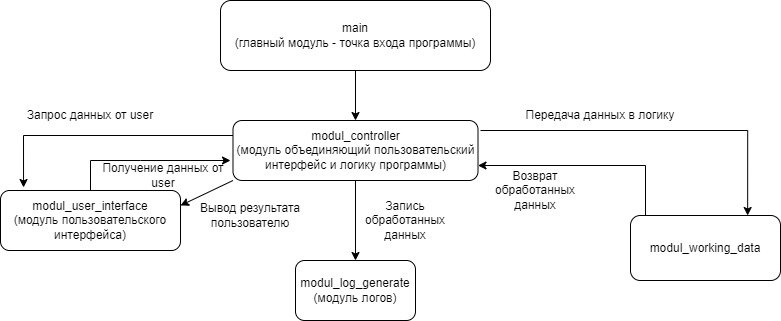

# Seminar_8
### Формат работы над задачами:

1. Студенты объединяются в группы по 3-5 человек
2. Прежде, чем приступать к написанию кода, студенты ****обдумывают “архитектуру” приложения используя листок и ручку или [https://app.diagrams.net/](https://app.diagrams.net/)  или аналоги с указанием основных системных единиц.
3. В каждой группе выделяются роли:
    1. Тим-лид - “главный”, который создает репозиторий. В этот репозиторий должен попасть весь код, написанный командой (вспоминаем работу с гитом)
    2. Студенты делят между собой модули программы. Каждый член команды пишет свой модуль. 
        
        Пример с лекции в файле Лекция 4.zip
        
**Задача:** Создать информационную систему позволяющую работать с сотрудниками некой компании \ студентами вуза \ учениками школы

*(прямая отсылка [к первому семинару “введение в базы данных”](https://www.notion.so/ada887424df04be6b876ee8734aabcf1))*

<aside>
❗ Решение каждой задачи начинается с обсуждения, только после этого пишется код.

# Homework(Seminar_8)
Доделать решение задачи: Задача: Создать информационную систему позволяющую работать с сотрудниками некой компании \ студентами вуза \ учениками школы
## Основные возможности программы

1. Импортирование БД из txt файлов(data_department, data_workes);
2. Резервное копирование БД во время начала работы (data_department_backup, data_workes_backup);
3. Ввод новых данных через консоль;
4. Экспорт конечных данных в файл csv двумя способами("на одной строке", "построчно")

### Архитектура программы

